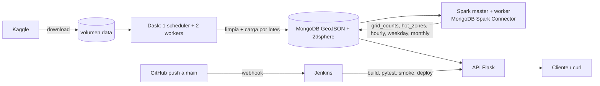

# Taxi Geo — NYC Taxi Trip Duration (Dask + Spark + MongoDB + Flask + Jenkins)

## Arquitectura



## Levantar desde cero (requiere solo Docker + Docker Compose v2, ~6 GB de RAM libres)

```bash
git clone <URL_DEL_REPO> && cd taxi-geo
cp .env.example .env            # pon tus credenciales de Kaggle y acepta las reglas de la competencia

docker compose up -d --build    # mongo, spark (master+worker), dask (scheduler+2 workers), api, jenkins
docker compose run --rm download   # baja train.csv a un volumen (1.4 M filas)
docker compose run --rm ingest     # Dask: limpia y carga en Mongo, crea índice 2dsphere
docker compose run --rm spark-submit /app/spark_jobs/aggregations.py   # Spark: agregaciones -> colecciones nuevas
```

Si no tienes credenciales de Kaggle: descarga `train.zip` a mano y ejecuta
`docker compose run --rm -v "$PWD/train.zip:/data/train.zip" download`.

UIs: Spark `http://localhost:8080` · Dask `http://localhost:8787` · API `http://localhost:5000` · Jenkins `http://localhost:8081`

## Endpoints

```bash
# 1) Cercanos ($near): lat, lon, radius en metros, limit opcional
curl "localhost:5000/nearby?lat=40.758&lon=-73.9855&radius=300&limit=5"

# 2) Dentro de un polígono ($geoWithin): GeoJSON en el cuerpo
curl -X POST localhost:5000/within -H "Content-Type: application/json" -d '{
 "type":"Polygon","coordinates":[[[-74.0,40.75],[-73.97,40.75],[-73.97,40.77],[-74.0,40.77],[-74.0,40.75]]]}'

# 3) Agregación $geoNear: viajes cerca de un punto, por hora
curl "localhost:5000/geonear?lat=40.758&lon=-73.9855&radius=1000"

# 4) Resultados de Spark: grid_counts | hot_zones | hourly | weekday | monthly
curl "localhost:5000/spark/hot_zones?limit=10"
```

## Pruebas locales
```bash
docker compose run --rm --no-deps api pytest -q tests/unit
```

## Benchmark Dask vs Spark (misma operación: conteo y duración media por celda de grilla, leyendo el CSV)
```bash
python3 bench/run_bench.py dask 1 ; python3 bench/run_bench.py dask 2
python3 bench/run_bench.py spark 1 ; python3 bench/run_bench.py spark 2
cat bench/results.csv      # motor, workers, mediana de 3 corridas (s), pico de memoria (MB)
```
Cada worker = 1 núcleo y 1 GB en ambos motores, para que la comparación sea justa.

## CI/CD con Jenkins
1. `docker compose logs jenkins | grep -A2 password` → clave inicial en `http://localhost:8081` (plugins git/pipeline/github ya incluidos).
2. Nuevo ítem → *Pipeline* → "Pipeline script from SCM" → Git → URL del repo → rama `*/main` → Script Path `Jenkinsfile`.
3. Marca **GitHub hook trigger for GITScm polling**.
4. En GitHub: Settings → Webhooks → `http://<URL pública>/github-webhook/` (si estás en local, expón el 8081 con ngrok o smee.io).
5. Cada push/merge a `main` ejecuta: checkout → build → pytest → stack de pruebas → smoke tests → deploy. Si algo falla, no hay deploy.

## Flujo de trabajo en Git
Ramas `feature/...` por integrante, Pull Request a `main`, mínimo un commit real de cada persona.
